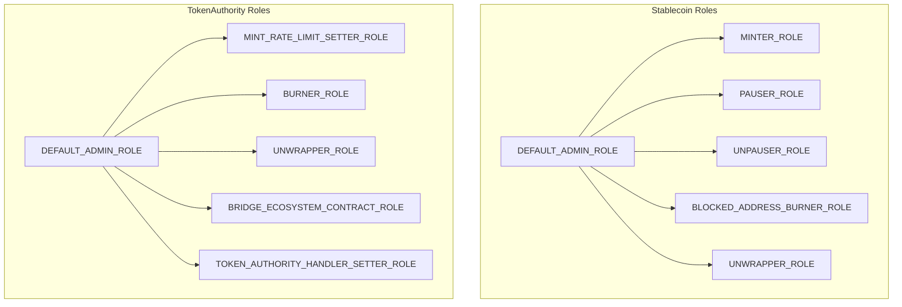
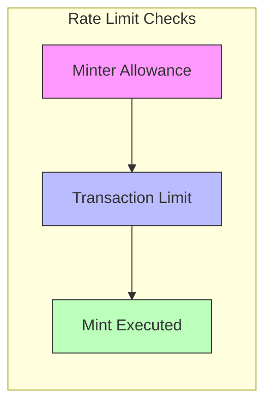
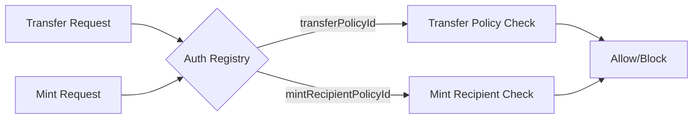

# Access Control

## Role Hierarchy

## Stablecoin Roles

### `DEFAULT_ADMIN_ROLE`
Full administrative control over the stablecoin.

| Permission | Function |
|------------|----------|
| Set max supply | `setMaxSupply(uint256)` |
| Set transfer policy | `setTransferPolicyId(uint64)` |
| Set mint recipient policy | `setMintRecipientPolicyId(uint64)` |
| Complete migration | `completeMigrationToWrapped()` |
| Upgrade implementation | `upgradeToAndCall(address, bytes)` |
| Manage roles | `grantRole()`, `revokeRole()` |

### `MINTER_ROLE`
Token minting and burning operations.

| Permission | Function |
|------------|----------|
| Mint tokens | `mint(address, uint256)` |
| Burn tokens | `burn(uint256)` |
| Unwrap tokens | `unwrap(address, uint256)` |

Note: `mint()` is disabled after `completeMigrationToWrapped()` is called.

### `PAUSER_ROLE`
Emergency pause capability.

| Permission | Function |
|------------|----------|
| Pause transfers | `pause()` |

### `UNPAUSER_ROLE`
Resume normal operations.

| Permission | Function |
|------------|----------|
| Unpause transfers | `unpause()` |

### `BLOCKED_ADDRESS_BURNER_ROLE`
Force-liquidate blocked addresses.

| Permission | Function |
|------------|----------|
| Burn blocked balances | `burnFromBlockedAddress(address)` |

### `UNWRAPPER_ROLE`
Convert stablecoins back to reserve tokens.

| Permission | Function |
|------------|----------|
| Unwrap tokens | `unwrap(address, uint256)` |

## TokenAuthority Roles

### `DEFAULT_ADMIN_ROLE`
Full administrative control over TokenAuthority.

| Permission | Function |
|------------|----------|
| Register stablecoins | `registerStablecoin(address, address)` |
| Unregister stablecoins | `unregisterStablecoin(address)` |
| Manage roles | `grantRole()`, `revokeRole()` |
| Upgrade implementation | `upgradeToAndCall(address, bytes)` |

### `MINT_RATE_LIMIT_SETTER_ROLE`
Configure minting rate limits.

| Permission | Function |
|------------|----------|
| Set minter allowance | `setMinterAllowance(address, address, uint256)` |
| Set transaction limit | `setMintTxnLimit(address, uint256)` |

### `BURNER_ROLE`
Initiate token burns through TokenAuthority.

| Permission | Function |
|------------|----------|
| Burn tokens | `burn(address, uint256)` |

### `UNWRAPPER_ROLE`
Initiate unwrapping through TokenAuthority.

| Permission | Function |
|------------|----------|
| Unwrap tokens | `unwrap(address, address, uint256)` |

### `BRIDGE_ECOSYSTEM_CONTRACT_ROLE`
Trusted contracts that bypass rate limits.

| Permission | Function |
|------------|----------|
| Mint without limits | `mintBridgeEcosystem(address, address, uint256)` |

### `TOKEN_AUTHORITY_HANDLER_SETTER_ROLE`
Configure token handlers.

| Permission | Function |
|------------|----------|
| Set handler | `setTokenHandler(address, address)` |

## Rate Limiting

TokenAuthority enforces three-level rate limiting for minting:

| Level | Scope | Configuration |
|-------|-------|---------------|
| Minter Allowance | Per-user, per-stablecoin | Decrements with each mint |
| Transaction Limit | Per-stablecoin | Max amount per mint call |

## Auth Registry Integration

External policy-based access control:

| Policy | Purpose |
|--------|---------|
| `transferPolicyId` | Validates sender/recipient for transfers |
| `mintRecipientPolicyId` | Validates recipients for minting |

Blocked addresses cannot send or receive tokens. The `burnFromBlockedAddress()` function uses transient storage to temporarily bypass this restriction during force-liquidation.
