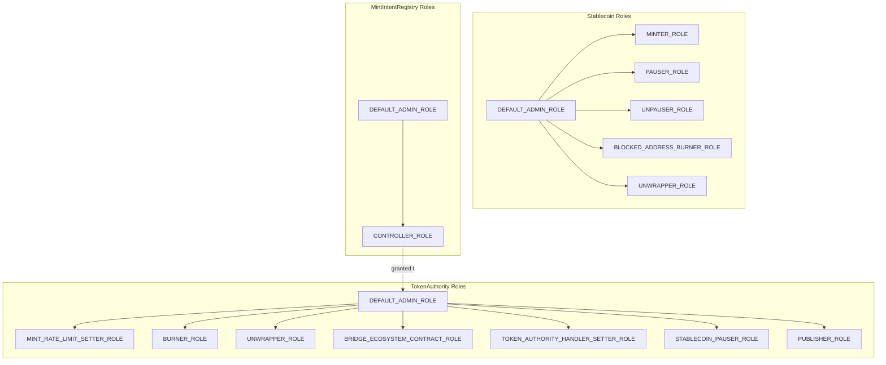
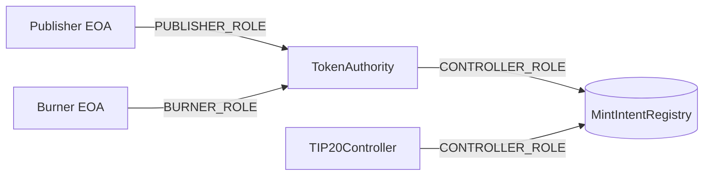
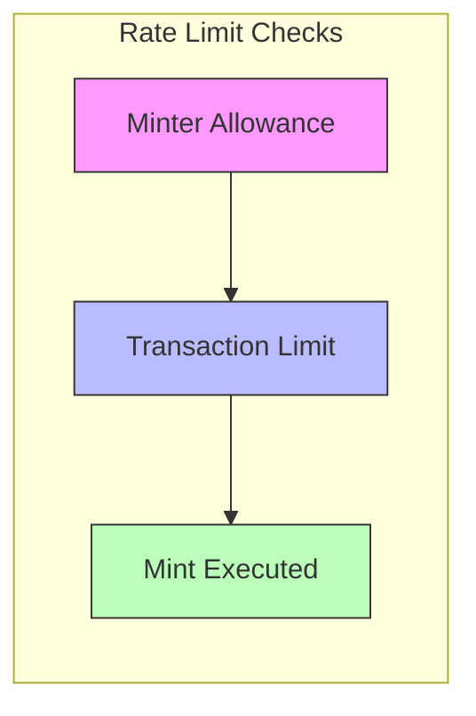
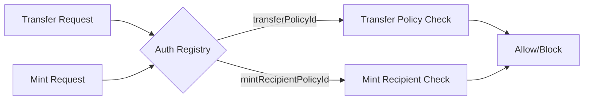

# Access Control

## Role Hierarchy

```mermaid
graph TB
    subgraph "Stablecoin Roles"
        DA[DEFAULT_ADMIN_ROLE]
        M[MINTER_ROLE]
        P[PAUSER_ROLE]
        UP[UNPAUSER_ROLE]
        BAB[BLOCKED_ADDRESS_BURNER_ROLE]
        UW[UNWRAPPER_ROLE]
    end

    subgraph "TokenAuthority Roles"
        TA_DA[DEFAULT_ADMIN_ROLE]
        MRLS[MINT_RATE_LIMIT_SETTER_ROLE]
        B[BURNER_ROLE]
        TA_UW[UNWRAPPER_ROLE]
        BEC[BRIDGE_ECOSYSTEM_CONTRACT_ROLE]
        THS[TOKEN_AUTHORITY_HANDLER_SETTER_ROLE]
        SP[STABLECOIN_PAUSER_ROLE]
        PUB[PUBLISHER_ROLE]
    end

    subgraph "MintIntentRegistry Roles"
        MIR_DA[DEFAULT_ADMIN_ROLE]
        CR[CONTROLLER_ROLE]
    end

    DA --> M
    DA --> P
    DA --> UP
    DA --> BAB
    DA --> UW

    TA_DA --> MRLS
    TA_DA --> B
    TA_DA --> TA_UW
    TA_DA --> BEC
    TA_DA --> THS
    TA_DA --> SP
    TA_DA --> PUB

    MIR_DA --> CR
    CR -.granted to.-> TA_DA
```

The same role set applies to `TIP20Controller`, which shares the `MintIntentRegistry` with `TokenAuthority`.

## Stablecoin Roles

### `DEFAULT_ADMIN_ROLE`
Full administrative control over the stablecoin.

| Permission | Function |
|------------|----------|
| Set max supply | `setMaxSupply(uint256)` |
| Set transfer policy | `setTransferPolicyId(uint64)` |
| Set mint recipient policy | `setMintRecipientPolicyId(uint64)` |
| Complete migration | `completeMigrationToWrapped()` |
| Upgrade implementation | `upgradeToAndCall(address, bytes)` |
| Manage roles | `grantRole()`, `revokeRole()` |

### `MINTER_ROLE`
Token minting and burning operations.

| Permission | Function |
|------------|----------|
| Mint tokens | `mint(address, uint256)` |
| Burn tokens | `burn(uint256)` |
| Unwrap tokens | `unwrap(address, uint256)` |

Note: `mint()` is disabled after `completeMigrationToWrapped()` is called.

### `PAUSER_ROLE`
Emergency pause capability.

| Permission | Function |
|------------|----------|
| Pause transfers | `pause()` |

### `UNPAUSER_ROLE`
Resume normal operations.

| Permission | Function |
|------------|----------|
| Unpause transfers | `unpause()` |

### `BLOCKED_ADDRESS_BURNER_ROLE`
Force-liquidate blocked addresses.

| Permission | Function |
|------------|----------|
| Burn blocked balances | `burnFromBlockedAddress(address)` |

### `UNWRAPPER_ROLE`
Convert stablecoins back to reserve tokens.

| Permission | Function |
|------------|----------|
| Unwrap tokens | `unwrap(address, uint256)` |

## TokenAuthority Roles

### `DEFAULT_ADMIN_ROLE`
Full administrative control over TokenAuthority.

| Permission | Function |
|------------|----------|
| Register stablecoins | `registerStablecoin(address, address, uint256)` |
| Set mint intent version | `setMintIntentVersion(MintIntentVersion)` |
| Migrate mint intent registry | `setMintIntentRegistry(address)` |
| Manage roles | `grantRole()`, `revokeRole()` |
| Upgrade implementation | `upgradeToAndCall(address, bytes)` |

### `MINT_RATE_LIMIT_SETTER_ROLE`
Configure minting rate limits.

| Permission | Function |
|------------|----------|
| Set minter allowance | `setMinterAllowance(address, address, uint256)` |
| Set transaction limit | `setTxnMintLimit(address, uint256)` |

### `BURNER_ROLE`
Initiate token burns through TokenAuthority.

| Permission | Function |
|------------|----------|
| Burn tokens | `burn(address, uint256)` |
| Burn against an operation ID | `burnWithOperationId(address, uint256, uint256)` |

### `PUBLISHER_ROLE`
Manage the mint intent lifecycle. Each function forwards to the shared `MintIntentRegistry`; the TokenAuthority itself must hold `CONTROLLER_ROLE` there.

| Permission | Function |
|------------|----------|
| Publish an approval | `publishApproval(ApprovalParams, uint64)` |
| Revoke an approval | `revokeApproval(bytes32)` |
| Revoke an operation ID | `revokeOperationId(uint256)` |
| Extend an approval's expiry | `extendApproval(bytes32, uint64)` |

### `STABLECOIN_PAUSER_ROLE`
Pause a single stablecoin's mint/burn/wrap/unwrap paths.

| Permission | Function |
|------------|----------|
| Pause or unpause a stablecoin | `setStablecoinPaused(address, bool)` |

### `UNWRAPPER_ROLE`
Initiate unwrapping through TokenAuthority.

| Permission | Function |
|------------|----------|
| Unwrap tokens | `unwrap(address, address, uint256)` |

### `BRIDGE_ECOSYSTEM_CONTRACT_ROLE`
Trusted contracts that bypass rate limits.

| Permission | Function |
|------------|----------|
| Mint without limits | `mintBridgeEcosystem(address, address, uint256)` |

### `TOKEN_AUTHORITY_HANDLER_SETTER_ROLE`
Configure token handlers.

| Permission | Function |
|------------|----------|
| Set handler | `setTokenHandler(address, address)` |
| Unregister stablecoins | `unregisterStablecoin(address)` |

## MintIntentRegistry Roles

One registry is shared by every controller deployment so that operation IDs and hold IDs are single-use across all of them, not once per controller.

### `DEFAULT_ADMIN_ROLE`
Controls which controllers may share the intent namespace.

| Permission | Function |
|------------|----------|
| Authorize / de-authorize a controller | `grantRole()`, `revokeRole()` |
| Upgrade implementation | `upgradeToAndCall(address, bytes)` |

### `CONTROLLER_ROLE`
Held by each controller contract (`TokenAuthority`, `TIP20Controller`) — never by an EOA. Controllers gate their own callers with `PUBLISHER_ROLE` / `BURNER_ROLE` before forwarding here.

`CONTROLLER_ROLE` alone is **not** sufficient to act on an arbitrary approval. Each approval records the controller that published it, and consuming, revoking, or extending is restricted to that controller — otherwise the call reverts with `NotApprovalController`. The role admits a controller to the shared ID namespace; it does not grant authority over other controllers' approvals.

| Permission | Function | Additionally requires |
|------------|----------|-----------------------|
| Publish an approval | `publishApproval(ApprovalParams, uint64)` | ID unused registry-wide |
| Revoke an approval | `revokeApproval(bytes32)` | caller published it |
| Revoke an operation ID | `revokeOperationId(uint256)` | caller published it, if an approval exists |
| Extend an approval's expiry | `extendApproval(bytes32, uint64)` | caller published it |
| Consume an approval | `consumeApproval(ApprovalParams)` | caller published it |
| Consume an unused operation ID | `consumeUnusedOperationId(uint256)` | — (unowned) |

Granting this role is what admits a controller into the shared namespace:

```mermaid
graph LR
    PUB[Publisher EOA] -->|PUBLISHER_ROLE| TA[TokenAuthority]
    BRN[Burner EOA] -->|BURNER_ROLE| TA
    TA -->|CONTROLLER_ROLE| MIR[(MintIntentRegistry)]
    T20[TIP20Controller] -->|CONTROLLER_ROLE| MIR
```

Revoking `CONTROLLER_ROLE` from a controller halts all of its intent operations while leaving existing intent state intact.

## Rate Limiting

TokenAuthority enforces three-level rate limiting for minting:

```mermaid
graph LR
    subgraph "Rate Limit Checks"
        A[Minter Allowance] --> B[Transaction Limit]
        B --> C[Mint Executed]
    end

    style A fill:#f9f,stroke:#333
    style B fill:#bbf,stroke:#333
    style C fill:#bfb,stroke:#333
```

| Level | Scope | Configuration |
|-------|-------|---------------|
| Minter Allowance | Per-user, per-stablecoin | Decrements with each mint |
| Transaction Limit | Per-stablecoin | Max amount per mint call |

## Auth Registry Integration

External policy-based access control:

```mermaid
graph LR
    Transfer[Transfer Request] --> AR{Auth Registry}
    Mint[Mint Request] --> AR
    AR -->|transferPolicyId| TP[Transfer Policy Check]
    AR -->|mintRecipientPolicyId| MP[Mint Recipient Check]
    TP --> Allow/Block
    MP --> Allow/Block
```

| Policy | Purpose |
|--------|---------|
| `transferPolicyId` | Validates sender/recipient for transfers |
| `mintRecipientPolicyId` | Validates recipients for minting |

Blocked addresses cannot send or receive tokens. The `burnFromBlockedAddress()` function uses transient storage to temporarily bypass this restriction during force-liquidation.
