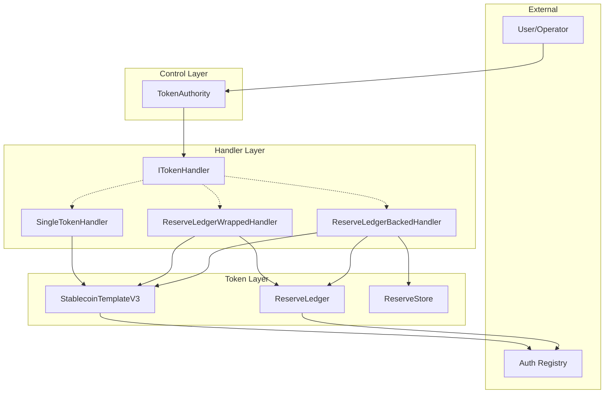
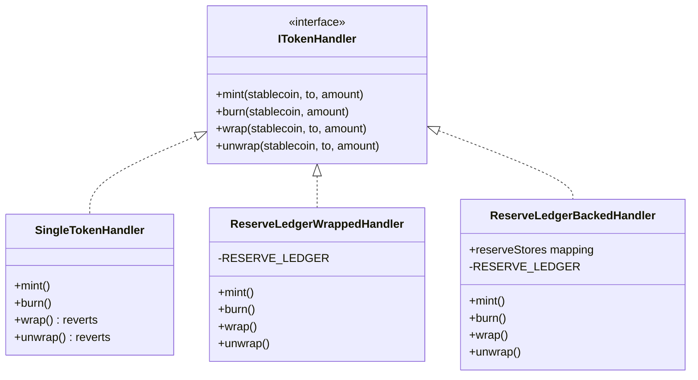
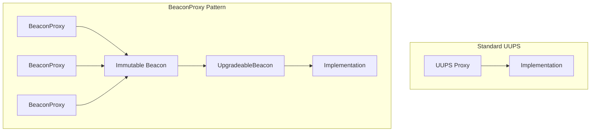

# Architecture Overview

Bridge's ERC20 stablecoin template provides upgrade-capable stablecoin tokens with sophisticated access control, minting rate limits, and flexible collateralization models.

## System Overview



## Component Relationships

### Core Contracts

| Contract | Purpose |
|----------|---------|
| `TokenAuthority` | Central control for minting, burning, wrapping, unwrapping with rate limiting |
| `StablecoinTemplateV3` | Wrapped stablecoin with reserve ledger backing |
| `ReserveLedger` | Simple stablecoin without wrapping capability |
| `ReserveStore` | Isolated collateral storage per stablecoin |

### Token Handlers

The system uses the Strategy pattern for flexible collateralization:



| Handler | Collateral Model | Use Case |
|---------|-----------------|----------|
| `SingleTokenHandler` | No collateral | Simple tokens, direct mint/burn |
| `ReserveLedgerWrappedHandler` | Stored in stablecoin contract | Compact collateral model |
| `ReserveLedgerBackedHandler` | Isolated `ReserveStore` per token | Auditable, reconcilable reserves |

## Upgrade Architecture

The system uses UUPS (Universal Upgradeable Proxy Standard) with optional BeaconProxy support:



The BeaconProxy pattern enables:
- Deterministic deployment via Deterministic Proxy Factory
- Centralized upgrades across all tokens on a chain
- Optional handoff of upgrade authority to token owners

## Storage Layout (EIP-7201)

All contracts use EIP-7201 namespaced storage to prevent slot collisions during upgrades:

```solidity
// Storage namespace for StablecoinTemplateV3
keccak256("bridge.storage.StablecoinTemplateV3") - 1

// Storage namespace for TokenAuthority
keccak256("bridge.storage.TokenAuthority") - 1
```

## External Dependencies

- **Auth Registry**: External policy-based access control for transfers and minting
- **OpenZeppelin Contracts v5.3.0**: Base implementations for ERC20, AccessControl, Pausable, UUPS
- **Deterministic Proxy Factory**: CREATE2-based deterministic deployments
