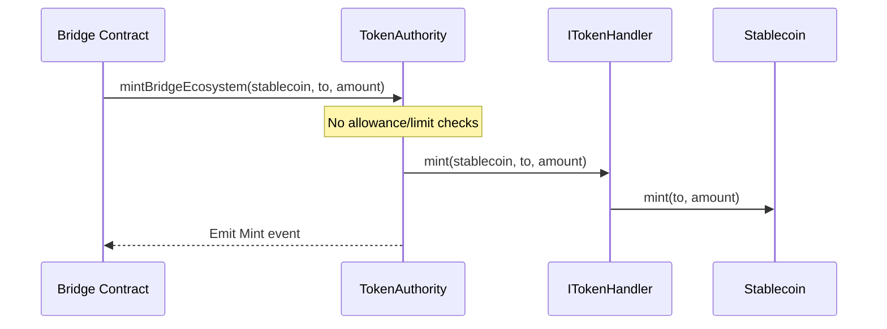
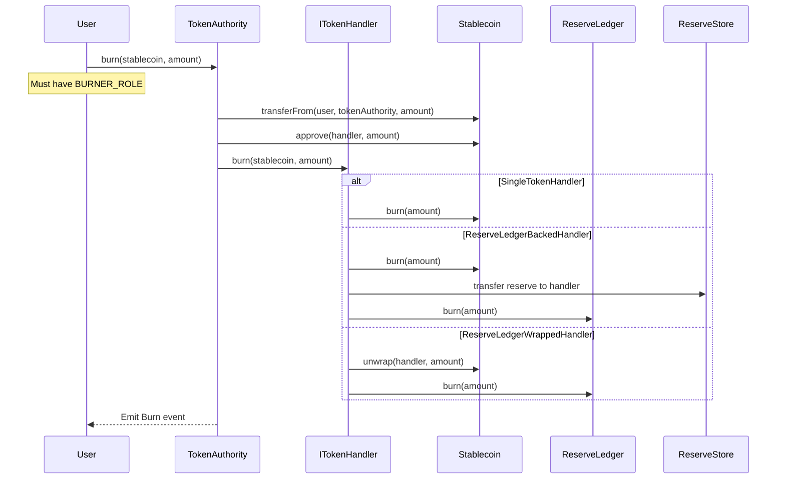
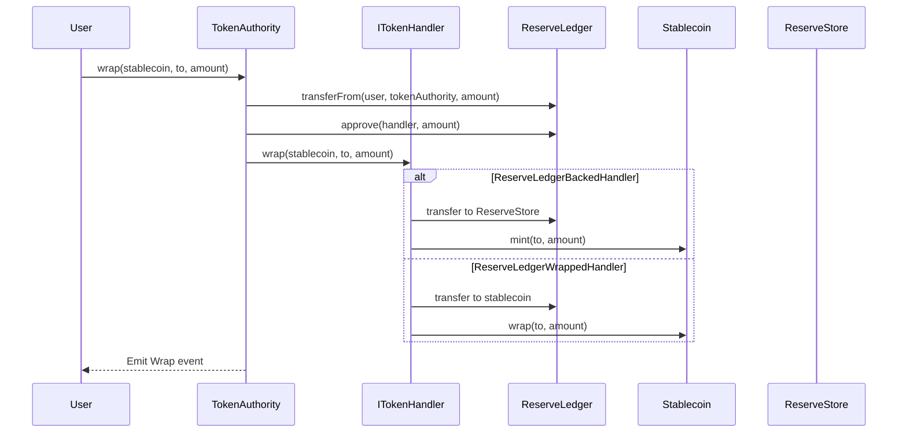
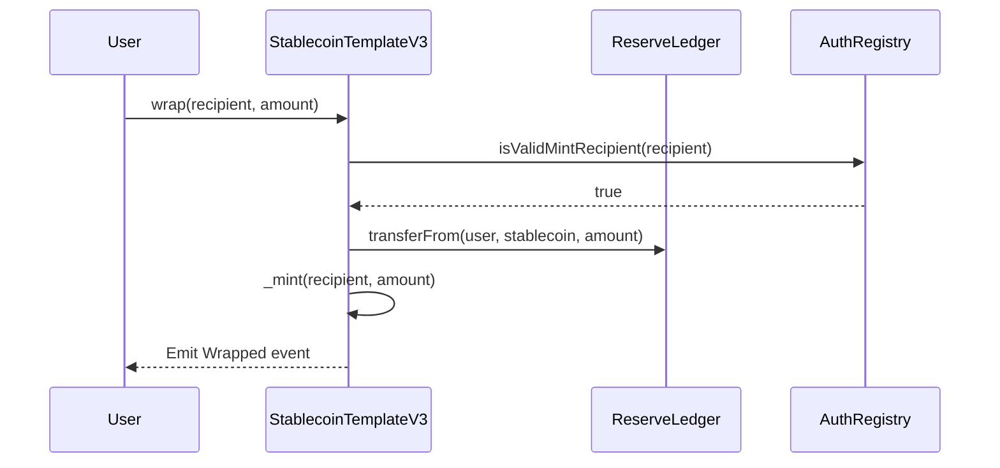
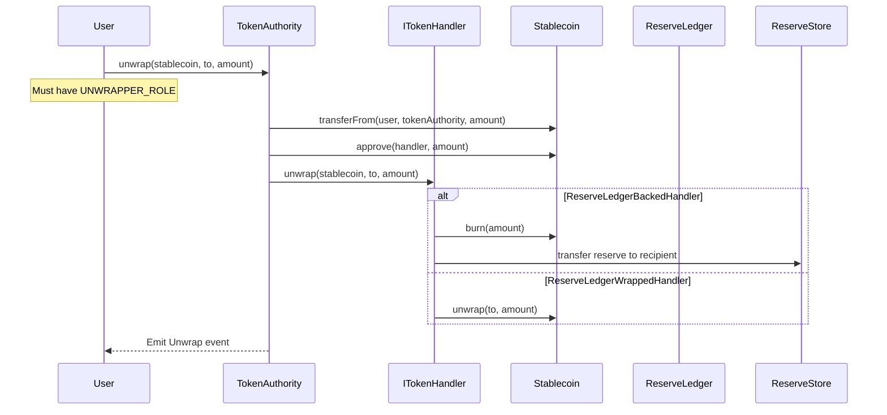
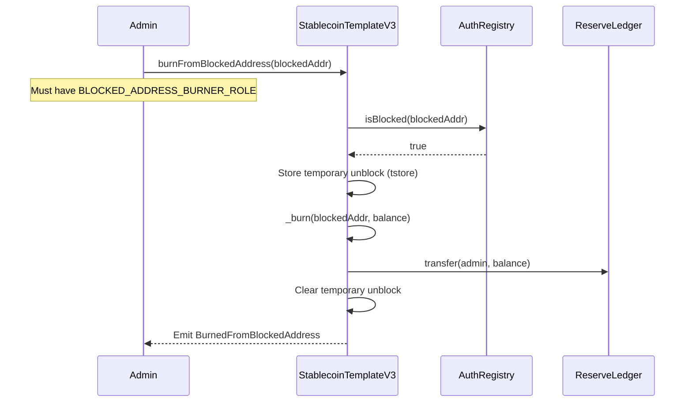
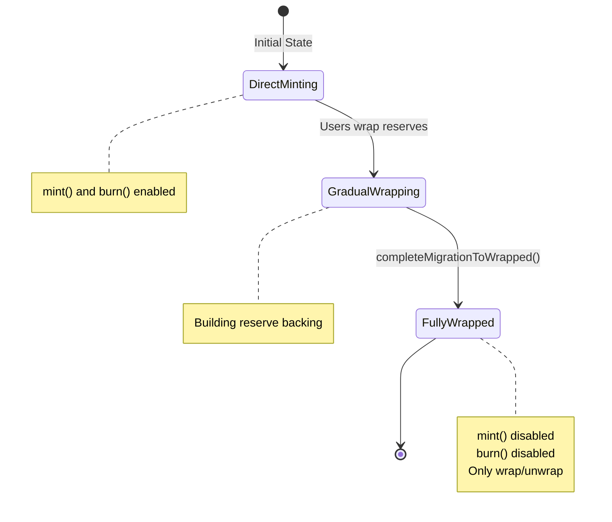

# Operation Flows

## Minting

### Via TokenAuthority (Rate-Limited)

```mermaid
sequenceDiagram
    participant User
    participant TA as TokenAuthority
    participant Handler as ITokenHandler
    participant RL as ReserveLedger
    participant SC as Stablecoin

    User->>TA: mint(stablecoin, to, amount)
    TA->>TA: Check minter allowance
    TA->>TA: Check txn limit
    TA->>TA: Decrement allowance
    TA->>Handler: mint(stablecoin, to, amount)

    alt SingleTokenHandler
        Handler->>SC: mint(to, amount)
    else ReserveLedgerBackedHandler
        Handler->>Handler: Get/create ReserveStore
        Handler->>RL: mint(reserveStore, amount)
        Handler->>SC: mint(to, amount)
    else ReserveLedgerWrappedHandler
        Handler->>RL: mint(stablecoin, amount)
        Handler->>SC: wrap(to, amount)
    end

    TA-->>User: Emit Mint event
```

### Bridge Ecosystem Mint (No Rate Limit)

Trusted contracts with `BRIDGE_ECOSYSTEM_CONTRACT_ROLE` bypass rate limits:

## Burning

## Wrapping (Deposit Reserve → Get Stablecoin)

### Direct Wrapping (No TokenAuthority)

## Unwrapping (Burn Stablecoin → Get Reserve)

## Burning From Blocked Address

Allows force-liquidation of sanctioned addresses:

## Migration to Wrapped

Transition from credit-based to fully-collateralized model:

Requirements for migration:
1. `RESERVE_LEDGER` balance must equal total supply (full collateralization)
2. Only admin can trigger migration
3. Irreversible once completed
